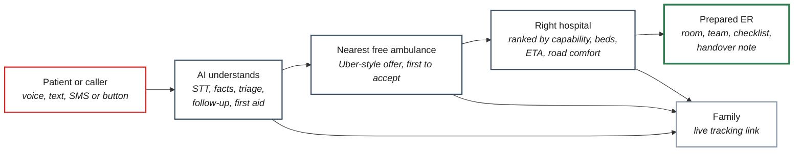
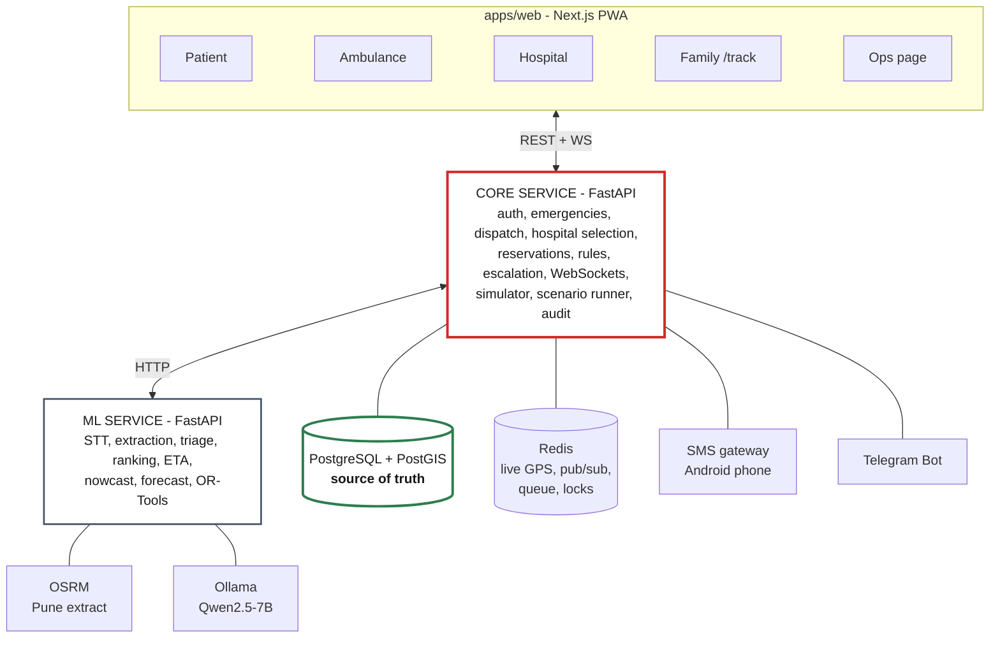
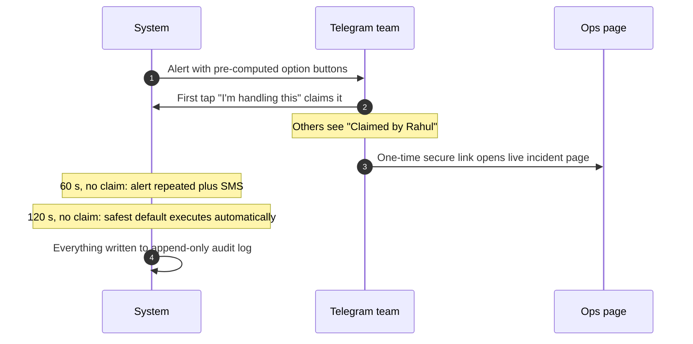

<div align="center">


<br/>

**A real-time emergency resource allocator for Pune and Pimpri Chinchwad.**
Voice SOS in Hindi or Marathi, Uber-style ambulance dispatch, and a hospital that is actually ready.

<br/>

[](TODO_LIVE_URL)

<br/>


</div>

---

## The 60-second version

> When someone in India has a heart attack, three things usually go wrong. **Ambulances and hospitals are disconnected**, so nobody knows which free ambulance is closest. **The nearest hospital is often the wrong one**: a cardiac patient taken to a trauma-only hospital, or one with no free bed, loses minutes being turned away. And **the ER finds out about the patient only when the ambulance reaches the door**, so no bed, doctor or equipment is ready.
>
> **GoldenHour connects the patient, the nearest free ambulance and the right hospital in real time.** The caller sends a voice note in Hindi, Marathi or English. AI extracts the facts and triages the case. The 4 best nearby ambulances get an offer at once, and the first to tap Accept wins. Hospitals are ranked by capability, bed likelihood, traffic ETA and road smoothness, not by distance. The hospital sees the patient coming, gets a ready-made handover note and prep checklist, and reserves the bed, specialist and equipment together.
>
> **A human is pulled in only for four kinds of crisis**, through Telegram, with one-tap options and a safe default if nobody answers within 2 minutes.

<div align="center">

### [**Run the demo**](TODO_LIVE_URL)
### [**Demo video**](TODO_VIDEO_URL)
*Demo sign in: OTP `482913` for the patient app, password `demo` for the ambulance and hospital apps.*

</div>

---

## Table of contents

| | Section | What's in it |
|---|---|---|
| 01 | [The problem](#01--the-problem-three-failures-in-the-first-hour) | Why the golden hour is lost |
| 02 | [The idea](#02--the-idea-one-connected-loop) | Patient, ambulance and hospital as one system |
| 03 | [The journey](#03--the-journey-one-emergency-nine-steps) | A real emergency in Akurdi, step by step |
| 04 | [Architecture](#04--architecture) | Services, data flow, contracts |
| 05 | [The intelligence layer](#05--the-intelligence-layer-20-ml-capabilities) | All 20 AI/ML capabilities |
| 06 | [The correctness layer](#06--the-correctness-layer-no-double-booking) | Concurrency, holds, idempotency, versioning |
| 07 | [Fail safe and escalation](#07--fail-safe-and-crisis-escalation) | When and how a human steps in |
| 08 | [Tough scenarios](#08--tough-scenarios-34-required-tests) | The situations that break other systems |
| 09 | [Results](#09--results) | Honest, held-out metrics |
| 10 | [Tech stack](#10--tech-stack) | What we use and why |
| 11 | [Quick start](#11--quick-start) | Running it |
| 12 | [Engineering war stories](#12--engineering-war-stories) | What broke and how we fixed it |
| 13 | [Honest caveats](#13--honest-caveats) | What we are not claiming |
| 14 | [Research grounding](#14--research-grounding) | Sources and datasets |

---

## 01 · The problem: three failures in the first hour

| # | What goes wrong | Consequence |
|:-:|---|---|
| 1 | **Ambulances and hospitals are disconnected.** Many ambulances are not owned by the hospital they end up serving. | Nobody coordinates which ambulance is closest and free. |
| 2 | **The nearest hospital is often the wrong hospital.** | A cardiac patient at a trauma-only hospital, or at one with no bed, gets turned away and moved again. |
| 3 | **Hospitals don't know who is coming.** | No bed, doctor or equipment is ready when the ambulance arrives. |

In heart attacks, strokes and major accidents, the first hour, the **golden hour**, decides survival. Every minute lost to confusion has a cost.

---

## 02 · The idea: one connected loop



**Who uses it**

| Who | Surface | What they do |
|---|---|---|
| Patient or caller | Patient web app, or plain SMS from any phone | Press SOS, record a voice note, or type or text what happened |
| Family | Tracking link sent by SMS | See ambulance, hospital and room, in their language |
| Ambulance crew | Ambulance web app | Accept jobs like an Uber ride, confirm triage in one tap |
| Hospital staff | Hospital web dashboard | See incoming patients, accept or reject, prepare rooms and doctors |
| On-call developers | Telegram bot + one-time ops page | Get pinged only in real crises, decide in one tap |

Everything is a website (Next.js, installable as a PWA). **No native app development.**

---

## 03 · The journey: one emergency, nine steps

*Ramesh's father collapses at home in Akurdi, Pune, clutching his chest.*

| # | Step | What happens |
|:-:|---|---|
| 1 | **SOS** | Ramesh records a Hindi-Marathi voice note. He could also press the button, type, or SMS from a basic phone. |
| 2 | **AI understands** | Speech becomes text. Facts are extracted: about 60, male, chest pain, breathing difficulty, sweating. Triage: **Critical, Cardiac**, with a confidence score. His saved health profile (allergies, blood group) is attached. |
| 3 | **Dispatch** | The 4 best nearby **ALS** ambulances get the offer. The first to Accept wins. The rest are released instantly. |
| 4 | **While waiting** | Live map and ETA range. The AI asks follow-up questions in his language and gives **fixed, verified** first-aid steps. The family gets an SMS tracking link. |
| 5 | **Pickup** | The paramedic sees the AI assessment and taps Confirm, or the correct category. That is their only job in the app. |
| 6 | **Hospital choice** | Ranked by cath lab available, cardiologist on duty, bed likely free, traffic ETA and road smoothness. The system explains why. |
| 7 | **Hospital prepares** | Dashboard: *"Critical cardiac patient, arriving in 11 minutes."* Live ambulance, handover summary, prep checklist. Staff tap Accept. Room and doctors are allocated automatically. |
| 8 | **Everyone knows** | Paramedic and family see the bay, gate and receiving team. |
| 9 | **Handover** | Arrival is detected. Staff tap Patient received. Offload delay is recorded. The ambulance goes for cleaning, then becomes available again. |

---

## 04 · Architecture



| Service | Tech | Responsibility |
|---|---|---|
| `apps/web` | Next.js (App Router), TypeScript | Every UI surface |
| `services/core` | FastAPI, Python 3.11+ | Business logic, state machines, concurrency, escalation, WebSockets, simulator |
| `services/ml` | FastAPI, Python 3.11+ | Every AI/ML model behind a stable HTTP contract |
| `postgres` | PostgreSQL 16 + PostGIS 3 | **Source of truth** for reservations, assignments, statuses |
| `redis` | Redis 7 | Live GPS, pub/sub fan-out, job queue, rate limits, leader lock |
| `osrm` | OSRM (Pune extract) | Routes, geometry, distance tables |
| `ollama` | Qwen2.5-7B-Instruct | Local LLM, no external API needed |

**Why this split:** Core and ML talk over HTTP, so models can change without touching business logic. Postgres holds all correctness-critical state, so losing Redis never corrupts anything. WebSockets carry everything live, and REST carries every mutation, each idempotent and versioned.

### Contracts first, so three people can build in parallel

`openapi.core.yaml`, `ws-events.schema.json` and `openapi.ml.yaml` are frozen in the first 3 hours (tag `contracts-v1`). Every module runs on mocks (Prism, a WS mock, `ML_MODE=mock`, fake SMS and Telegram), and CI breaks if any side drifts from the contract.

| Owner | Area |
|---|---|
| **Person A** | Intake and dispatch: STT, extraction, triage, dispatch, realtime |
| **Person B** | Hospital routing and control: ETA, road comfort, hospital rank, reservations, timers, escalation |
| **Person C** | Frontend and caller-assist AI: all UIs, follow-up questions, first aid, translation, TTS |

---

## 05 · The intelligence layer: 20 ML capabilities

| # | Capability | Endpoint | What it does |
|:-:|---|---|---|
| 1 | Speech-to-text | `/ml/v1/stt` | Hindi, Marathi, English and mixed speech |
| 2 | Structured extraction | `/ml/v1/extract` | Age, symptoms, conscious, breathing, bleeding, landmark |
| 3 | Triage | `/ml/v1/triage` | Critical, Urgent or Stable, plus facility type, with confidence |
| 4 | Prank score | `/ml/v1/prank-score` | Flags suspicious calls, never blocks a real emergency |
| 5 | Duplicate check | `/ml/v1/duplicate-check` | Five callers, one accident, one ambulance |
| 6 | Dispatch ranking | `/ml/v1/dispatch-rank` | Predicts who accepts fastest and arrives soonest |
| 7 | Follow-up questions | `/ml/v1/followup/next` | Picks from fixed, translated protocol questions |
| 8 | First aid | `/ml/v1/first-aid` | Deterministic, verified scripts only |
| 9 | Handover note | `/ml/v1/handover` | Clean medical summary before the crew reaches the patient |
| 10 | Resource prediction | `/ml/v1/resources` | Specialist, equipment and blood likely needed |
| 11 | Traffic-aware ETA | `/ml/v1/eta` | Honest range, e.g. "12 min (10-16 min)" |
| 12 | Road comfort | `/ml/v1/road-comfort` | Surface, speed breakers and turns, for fracture, spine and pregnancy cases |
| 13 | Hospital ranking | `/ml/v1/hospital-rank` | Ranked with a written explanation |
| 14 | Bed nowcasting | `/ml/v1/bed-nowcast` | Is a bed still free when the data is old? |
| 15 | Demand forecast | `/ml/v1/demand-forecast` | Where emergencies are likely in the next hour |
| 16 | Pre-positioning | `/ml/v1/preposition` | Moves idle ambulances toward forecast demand |
| 17 | Mass-casualty allocation | `/ml/v1/mci-allocate` | OR-Tools plan across hospitals by severity and capacity |
| 18 | Translation | `/ml/v1/translate` | IndicTrans2, en, hi, mr |
| 19 | Text-to-speech | `/ml/v1/tts` | Indic Parler-TTS, pre-rendered protocol audio |
| 20 | Learning loop | `/ml/v1/feedback/triage` | Every paramedic correction becomes training data |

**Two hard rules on medical content**

- **The LLM never writes question text.** Follow-up questions and their hindi and marathi translations are fixed in JSON, and the LLM only picks an ID from the candidates. An invalid ID falls back to the highest-priority unanswered question.
- **No generated medical text, ever.** First aid is a deterministic rule table mapping facility and extracted facts to a fixed script (hands-only CPR, choking, severe bleeding, burns, seizure, and so on), with priority overrides such as `breathing == "none"` always meaning CPR. Scripts cite Indian Red Cross or BLS lay-rescuer guidance.

---

## 06 · The correctness layer: no double-booking

**Correctness under concurrency is enforced by the database, not the UI.**

| Problem | How it is prevented |
|---|---|
| Two ambulances for the last cardiac bed | The bed can be soft-held by one request only. The second ambulance is redirected to the next-best hospital. |
| Two drivers tap Accept together | Only one accept succeeds. The other sees `409 ALREADY_TAKEN`. |
| One ambulance, two jobs | One active job per ambulance, and accepting cancels its other pending offers. |
| Bed free but specialist or equipment is not | The whole bundle (bed, specialist, equipment) is reserved **all or nothing**. |
| Hold expires while the ambulance is stuck in traffic | The hold auto-extends from live ETA. It expires only if the ambulance goes silent. |
| Ghost reservation after a cancellation | Released instantly, with expiry as a safety net. |
| Weak network sends the same request twice | Every mutation carries an `Idempotency-Key`. Repeats are recognised and ignored. |
| Old update arrives after a newer one | Every record has a version. Older writes never overwrite newer ones (`409 VERSION_CONFLICT`). |
| Walk-in patient takes a reserved bed | Staff must give a reason to override. The system tries another bed in the same hospital, else redirects the ambulance with top priority. |

**Key timing constants** (overridable via env)

| Constant | Value |
|---|---|
| Dispatch radii | 5, 10, 20 km |
| Ambulances offered per round | 4 |
| Offer expiry | 20 s |
| Next dispatch round | every 30 s |
| Hospital must answer within | 45 s critical, 60 s other |
| Ambulance heartbeat | 5 s |
| Signal weak / lost | 30 s / 120 s |
| Data freshness | fresh under 10 min, aging under 30 min, stale beyond |
| Triage sent to review below | 0.60 confidence (ALS dispatched regardless) |

---

## 07 · Fail safe and crisis escalation

**Principle:** when anything fails, degrade toward a safe, explicit behaviour (fallback, escalation, **Call 108**), never toward silence. Patient screens always show Call 108, and it becomes a full-width banner if the server health check fails twice or an SOS fails after retries.

**A human is involved in only four cases:**

| Crisis | Trigger | Default action (★) |
|---|---|---|
| **Mass casualty** | 5 or more patients, or 3 or more calls within 300 m in 10 min | OR-Tools allocation plan |
| **No ambulance** | 3 dispatch rounds (about 90 s) with no accept | Widen to 40 km, include BLS for critical with ALS follow-up |
| **No hospital** | Ranked list exhausted | Stabilise at the nearest capable hospital, plan transfer |
| **System anomaly** | Call surge, SMS gateway down, hospital dashboard offline over 5 min, silent ambulance | Most conservative context-specific action |



Every option is pre-computed and validated before the alert is sent, and executing one calls the same domain functions as the automated path.

---

## 08 · Tough scenarios: 34 required tests

A feature is only done when its edge cases pass. These are the situations where most emergency systems break:

| Category | Scenarios covered |
|---|---|
| **Concurrency** | Double booking, simultaneous accept, one ambulance two calls, walk-in over a reserved bed, partial resources, expiring holds, ghost reservations, duplicate requests, out-of-order updates |
| **Network and system** | Ambulance loses signal mid-route (offline queue plus one-tap SMS fallback), hospital does not respond (auto-move to next, SMS to duty manager), server down (big Call 108) |
| **Dispatch** | No ambulance accepts (5, 10, 20 km then escalate), driver idle or driving the wrong way, vehicle breakdown |
| **Clinical** | Deterioration en route, wrong AI triage, family override, unknown patient, mass casualty, prank and duplicate calls |

The simulator drives the system through **the same public APIs real users use**. There are no demo-only shortcuts, no bypassed locks and no precomputed results.

---

## 09 · Results

> `TODO`: fill this section only with real, held-out numbers. Technical spec principle 4: *"Every model is trained, evaluated on a held-out set the model never saw, and reported with real metrics. Synthetic data is labelled synthetic."*

| Area | Metric | Value | Data |
|---|---|:-:|---|
| Triage | Accuracy, per-class recall, confusion matrix | `TODO` | `TODO` (label synthetic vs real) |
| Speech-to-text | Word error rate, hi / mr / en | `TODO` | `TODO` |
| Follow-up parse | Accuracy on 60 hand-written answers per language | `TODO` | hand-written |
| Translation | Native-speaker rating of 30 SMS templates | `TODO` | hi, mr |
| Bed nowcast | Error vs staleness | `TODO` | simulated |
| Scenario suite | 34 tough scenarios passing | `TODO / 34` | simulator |
| End-to-end | SOS to hospital accept, median time | `TODO` | simulator |

Report costs next to gains, the way TRIPWIRE reports precision alongside recall.

---

## 10 · Tech stack

| Layer | Technology | Why this one |
|---|---|---|
| **Frontend** | Next.js, TypeScript strict, Tailwind, shadcn/ui, TanStack Query, next-intl | Web-only PWA, works on any phone, no native code |
| **Maps** | MapLibre + OSM tiles, polyline6, H3 heatmaps | Free, fast, live ambulance animation |
| **Realtime** | WebSockets with `seq` and resync | WS is live truth, REST is full truth |
| **Backend** | FastAPI (core and ML) | Two independently runnable services |
| **Database** | PostgreSQL 16 + PostGIS | Locks and versions live in the database |
| **Cache and queue** | Redis 7 | Ephemeral only, losing it corrupts nothing |
| **Routing** | Self-hosted OSRM (Pune extract) | No per-request cost, works offline in the demo |
| **LLM** | Ollama, Qwen2.5-7B-Instruct | Local, free, no API key |
| **Indic language** | IndicTrans2, Indic Parler-TTS | en, hi, mr translation and speech |
| **Optimisation** | OR-Tools | Mass-casualty allocation |
| **Alerts** | Android SMS gateway, Telegram Bot API | Feature-phone support and crisis escalation |
| **Testing** | Playwright, Schemathesis, pytest | 3-browser E2E, contract tests |

### Repository layout

```
goldenhour/
├── Problem_approach/          planning docs (source of truth)
│   ├── Project idea.pdf
│   ├── technical.md
│   ├── wd-person-c-frontend.md
│   └── wd.pdf
├── frontend-screens.md        screen-by-screen content spec (P1-P26, A1-A11, H1-H9, O1-O3)
├── website/                   React + Vite site and clickable demo of every app (LIVE NOW)
│
├── apps/web/                  Next.js patient, ambulance, hospital, family, ops   (planned)
├── services/core/             FastAPI business logic                              (planned)
├── services/ml/               FastAPI, 20 ML capabilities                         (planned)
├── packages/contracts/        frozen OpenAPI and WebSocket contracts              (planned)
└── infra/                     Docker Compose: Postgres, Redis, OSRM, Ollama       (planned)
```

---

## 11 · Quick start

**The demo site (available now):**

```bash
git clone TODO_REPO_URL
cd TODO_REPO/website
npm install
npm run dev        # open the URL Vite prints
npm run build      # production bundle in website/dist/
```

| Route | Surface |
|---|---|
| `#/` | Public website, six languages |
| `#/app` | Patient app (OTP `482913`) |
| `#/crew` | Ambulance app (password `demo`) |
| `#/hospital` | Hospital dashboard (password `demo`) |
| `#/track/8Kq2` | Family tracking page |
| `#/ops` | Ops page |

Open them in separate tabs and they stay in sync, all driven by one shared simulated emergency.

**The full stack (once the monorepo lands):**

```bash
docker compose up -d      # Postgres, Redis, OSRM, Ollama
make up                   # core, ML, web
pnpm mock:core            # or run the frontend alone on Prism mocks
```

---

## 12 · Engineering war stories

> `TODO`: write these from what actually breaks while you build. TRIPWIRE's section works because each story has the same shape: **what we built, what broke, why, the fix.** Likely candidates from your design:

<details>
<summary><b>#1 - Idempotency under a flaky ambulance network</b></summary>

<br/>

*What we built / what broke / why / the fix.* `TODO`

</details>

<details>
<summary><b>#2 - Two drivers, one accept (the 409 race)</b></summary>

<br/>

`TODO`

</details>

<details>
<summary><b>#3 - Keeping the LLM out of medical text</b></summary>

<br/>

`TODO`

</details>

---

## 13 · Honest caveats

> Stated up front, before anyone has to ask.

| Claim | Status | Reality |
|---|:-:|---|
| **Hospital, ambulance and bed data** | **Simulated** | Every number is simulated for the demo and labelled *Simulated* in the UI. No real hospital data is used. |
| **The real applications** | **In progress** | The clickable demo in `website/` exists now. `apps/web`, `services/core`, `services/ml` and `packages/contracts` follow `technical.md` and are not all in the repo yet. `TODO`: update as they land. |
| **ML metrics** | **`TODO`** | Reported only from held-out sets. Synthetic training data is labelled synthetic. |
| **Hindi and Marathi text** | **Needs review** | Generated with IndicTrans2 and must be reviewed by a native speaker before it counts as verified. |
| **First-aid content** | **Not clinical advice** | Fixed scripts from lay first-aid guidance. Not a substitute for calling 108 or 112. |
| **Real 108 integration** | **Out of scope for MVP** | The system fails toward the real 108 and 112 numbers. It does not replace or integrate with them. |
| **Native mobile apps** | **Out of scope** | Web PWA only. |

---

## 14 · Research grounding

| Source | What we took from it |
|---|---|
| Indian Red Cross and standard BLS lay-rescuer guidance | Fixed first-aid scripts |
| **IndicTrans2** (AI4Bharat) | en, hi, mr translation |
| **Indic Parler-TTS** | Hindi and Marathi speech |
| **OSRM** + OpenStreetMap | Routing and geometry for Pune |
| **OR-Tools** (Google) | Mass-casualty allocation |
| **H3** (Uber) | Demand hotspot grid |
| `TODO` | Triage, STT and bed-nowcast datasets or papers you actually use |

---

<div align="center">

### Team Rocket

**HackMatrix 5.0** · Track 02 Healthcare · Problem Statement HLTH-02
`TODO`: venue and dates

<br/>

> *"The right ambulance. The right hospital. Ready before you arrive."*
>
> **When anything fails, we fail toward 108. Never toward silence.**

<br/>

[](TODO_LIVE_URL)


</div>
